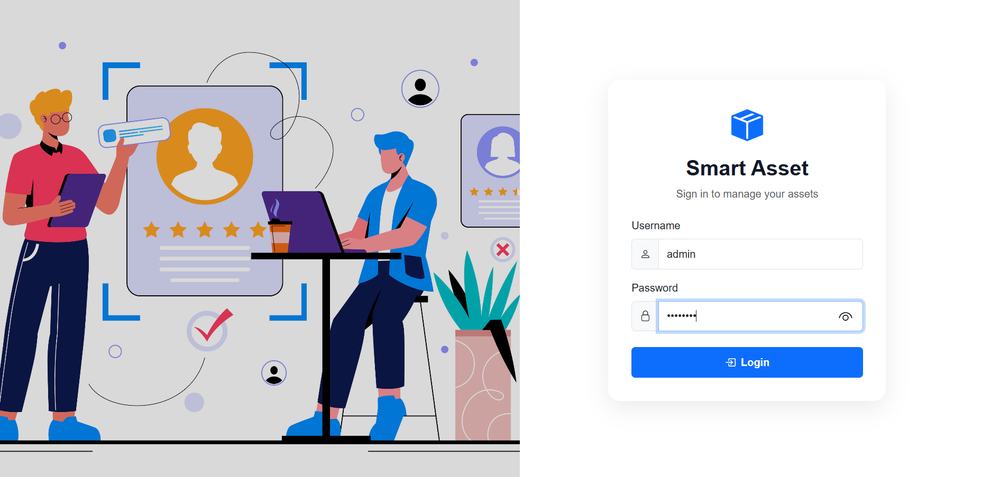
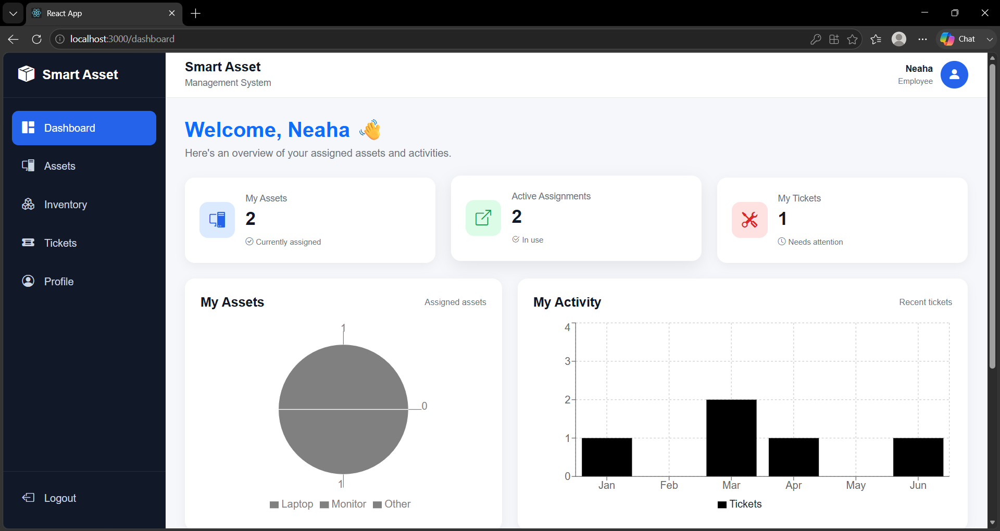
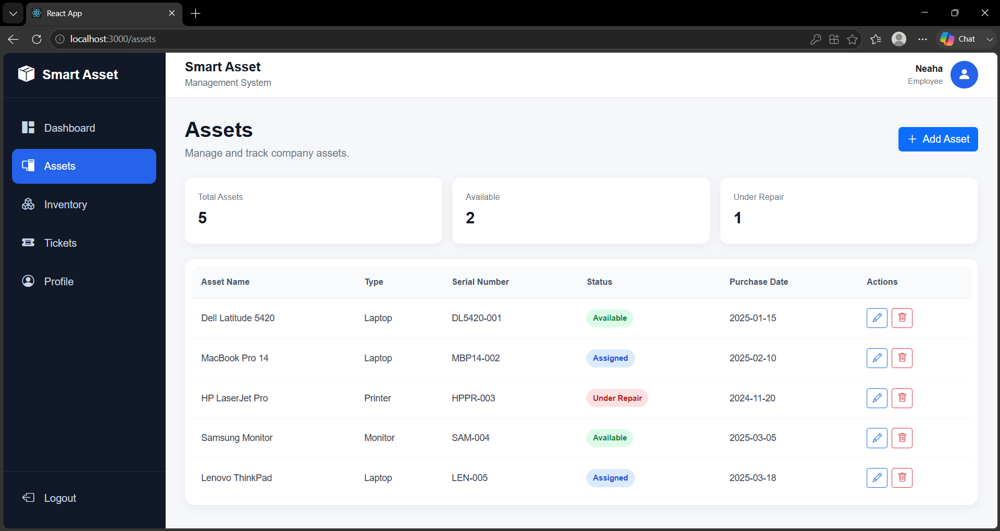
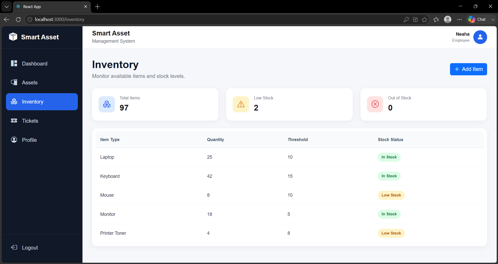
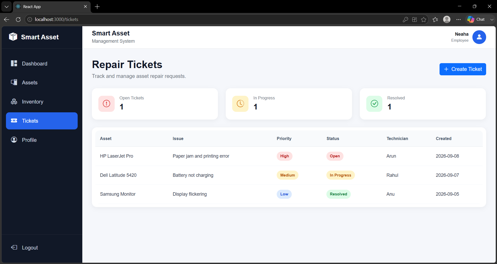
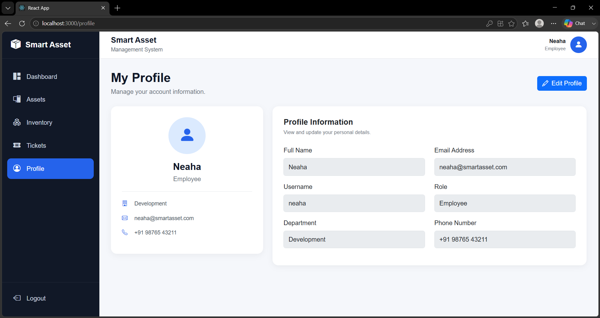

<div align="center">

# 📦 Smart Asset Management System


<br>


<br><br>


</div>

---

## 📋 About The Project

**Smart Asset Management System** is a responsive React frontend designed for managing company assets, inventory, assignments, and repair tickets.

This project is currently built with **mock data**, allowing the complete frontend experience to be developed before backend/API integration.

The interface provides separate experiences for **Administrator** and **Employee** users.

---

# ✨ Features

### 👨‍💼 Administrator

* 📊 Admin Dashboard
* 🖥️ Asset Management
* ➕ Add Assets
* ✏️ Edit Assets
* 🗑️ Delete Assets
* 📦 Inventory Management
* 🎫 Repair Ticket Management
* ➕ Create Repair Tickets
* 👤 Profile Management
* 📈 Dashboard Charts

### 👩‍💻 Employee

* 📊 Personal Dashboard
* 🖥️ View Assigned Assets
* 🎫 View Personal Tickets
* 👤 Profile
* 📈 Personal Activity Overview

---

# 🎨 User Interface

<div align="center">


</div>

---

# 👨‍💼 Admin Mode

## 🔐 Admin Login

<div align="center">



</div>

---

## 📊 Admin Dashboard

<div align="center">


</div>

The Admin Dashboard provides an overview of:

```text
📦 Total Assets
📤 Assigned Assets
✅ Available Assets
🛠️ Open Repair Tickets
📊 Asset Status Chart
📈 Monthly Asset Overview
🕒 Recent Activities
```

---

## 🖥️ Asset Management

<div align="center">


</div>

Administrators can view assets and manage their:

```text
Asset Name
Type
Serial Number
Status
Purchase Date
```

---

## ➕ Add Asset

<div align="center">


</div>

The Add Asset interface allows the administrator to enter asset information using a reusable modal form.

---

## 📦 Inventory

<div align="center">


</div>

Inventory provides stock information including:

```text
📦 Total Items
⚠️ Low Stock
❌ Out of Stock
✅ In Stock
```

---

## 🎫 Repair Tickets

<div align="center">


</div>

Administrators can monitor repair tickets by:

```text
Asset
Issue
Priority
Status
Technician
Created Date
```

---

## ➕ Create Repair Ticket

<div align="center">


</div>

The ticket creation form allows administrators to specify:

```text
🖥️ Asset
📝 Issue
🔥 Priority
👨‍🔧 Technician
```

---

## 👤 Admin Profile

<div align="center">


</div>

Administrators can view and edit their profile information.

---

# 👩‍💻 Employee Mode

## 🔐 Employee Login

<div align="center">


</div>

---

## 📊 Employee Dashboard

<div align="center">



</div>

The Employee Dashboard focuses on personal information such as:

```text
🖥️ My Assets
📤 Active Assignments
🎫 My Tickets
📊 Personal Asset Overview
📈 Recent Activity
```

---

## 🖥️ Employee Assets

<div align="center">



</div>

Employees can view their assigned assets and related information.

---

## 🎫 Employee Tickets

<div align="center">



</div>

Employees can view their repair-related activity and ticket information.

---

## 👤 Employee Profile

<div align="center">



</div>

Employees can view and update their profile information.

---

## 📱 Responsive Interface

<div align="center">



</div>

The frontend is designed to adapt to different screen sizes using responsive layouts and Bootstrap utilities.

---

# 🏗️ Project Architecture

```text
smart-asset-frontend/
│
├── public/
│
├── src/
│   │
│   ├── components/
│   │   ├── Layout.js
│   │   ├── Navbar.js
│   │   ├── Navbar.css
│   │   ├── Sidebar.js
│   │   ├── Sidebar.css
│   │   ├── Table.js
│   │   └── Table.css
│   │
│   ├── pages/
│   │   ├── Login.js
│   │   ├── Dashboard.js
│   │   ├── Dashboard.css
│   │   ├── Assets.js
│   │   ├── Assets.css
│   │   ├── Inventory.js
│   │   ├── Inventory.css
│   │   ├── Tickets.js
│   │   ├── Tickets.css
│   │   ├── Profile.js
│   │   └── Profile.css
│   │
│   ├── data/
│   │   └── mockData.js
│   │
│   ├── store/
│   │   └── store.js
│   │
│   ├── screenshots/
│   │   ├── adminlogin.png
│   │   ├── admin dashboard.png
│   │   ├── admin assets.png
│   │   ├── admin addassets.png
│   │   ├── admin inventory.png
│   │   ├── admin ticket.png
│   │   ├── admin createticket.png
│   │   ├── admin profile.png
│   │   ├── user login.png
│   │   ├── user1.png
│   │   ├── user2.png
│   │   ├── user3.png
│   │   ├── user4.png
│   │   └── user5.png
│   │
│   ├── App.js
│   ├── App.css
│   └── index.js
│
├── package.json
└── README.md
```

---

# 🧰 Technologies Used

<div align="center">


</div>

### Main Libraries

```text
⚛️ React
🚦 React Router
🔄 Redux Toolkit
🎨 Bootstrap
🎯 Bootstrap Icons
📊 Recharts
```

---

# 🔄 Application Flow

```text
                    🔐 LOGIN
                       │
          ┌────────────┴────────────┐
          │                         │
          ▼                         ▼
    👨‍💼 ADMIN                  👩‍💻 EMPLOYEE
          │                         │
          ▼                         ▼
    📊 Dashboard               📊 Dashboard
          │                         │
     ┌────┼────┐               ┌────┼────┐
     ▼    ▼    ▼               ▼    ▼    ▼
   Assets Inventory Tickets   Assets Tickets Profile
     │
     ▼
 Add / Edit / Delete
```

---

# 🚀 Getting Started

### 1. Clone the repository

```bash
git clone https://github.com/Neahans/smart-asset-frontend.git
```

### 2. Open the project

```bash
cd smart-asset-frontend
```

### 3. Install dependencies

```bash
npm install
```

### 4. Start the application

```bash
npm start
```

The application will be available at:

```text
http://localhost:3000
```

---

# 🧪 Mock Login

The current project uses mock users instead of a backend.

### 👨‍💼 Administrator

```text
Username: admin
Password: admin123
```

### 👩‍💻 Employee

```text
Username: neaha
Password: neaha123
```

Additional mock employees can be added through:

```text
src/data/mockData.js
```

---

# 📌 Current Project Status

<div align="center">

| Module              | Status     |
| ------------------- | ---------- |
| React Setup         | ✅ Complete |
| Routing             | ✅ Complete |
| Login               | ✅ Complete |
| Admin Dashboard     | ✅ Complete |
| Employee Dashboard  | ✅ Complete |
| Asset Management    | ✅ Complete |
| Inventory           | ✅ Complete |
| Repair Tickets      | ✅ Complete |
| Profile             | ✅ Complete |
| Reusable Table      | ✅ Complete |
| Mock Authentication | ✅ Complete |
| Responsive UI       | ✅ Complete |
| Backend Integration | ⏳ Future   |

</div>

---

# 🎯 Future Improvements

```text
🔗 Django REST API integration
🔐 Real authentication
🗄️ Database integration
👥 Real user management
📦 Real-time asset updates
🎫 Real ticket workflow
🔔 Notifications
📊 Advanced analytics
```

---

# 👩‍💻 Author

<div align="center">

## Neaha N S

💻 Computer Science Graduate
🐍 Python & Django Developer
⚛️ React Developer / Learner
🔐 Cybersecurity Enthusiast

<br>

<a href="https://github.com/Neahans">


</a>

</div>

---

<div align="center">


<br><br>

⭐ **Star this repository if you found it useful!**

</div>


# Getting Started with Create React App

This project was bootstrapped with [Create React App](https://github.com/facebook/create-react-app).

## Available Scripts

In the project directory, you can run:

### `npm start`

Runs the app in the development mode.\
Open [http://localhost:3000](http://localhost:3000) to view it in your browser.

The page will reload when you make changes.\
You may also see any lint errors in the console.

### `npm test`

Launches the test runner in the interactive watch mode.\
See the section about [running tests](https://facebook.github.io/create-react-app/docs/running-tests) for more information.

### `npm run build`

Builds the app for production to the `build` folder.\
It correctly bundles React in production mode and optimizes the build for the best performance.

The build is minified and the filenames include the hashes.\
Your app is ready to be deployed!

See the section about [deployment](https://facebook.github.io/create-react-app/docs/deployment) for more information.

### `npm run eject`

**Note: this is a one-way operation. Once you `eject`, you can't go back!**

If you aren't satisfied with the build tool and configuration choices, you can `eject` at any time. This command will remove the single build dependency from your project.

Instead, it will copy all the configuration files and the transitive dependencies (webpack, Babel, ESLint, etc) right into your project so you have full control over them. All of the commands except `eject` will still work, but they will point to the copied scripts so you can tweak them. At this point you're on your own.

You don't have to ever use `eject`. The curated feature set is suitable for small and middle deployments, and you shouldn't feel obligated to use this feature. However we understand that this tool wouldn't be useful if you couldn't customize it when you are ready for it.

## Learn More

You can learn more in the [Create React App documentation](https://facebook.github.io/create-react-app/docs/getting-started).

To learn React, check out the [React documentation](https://reactjs.org/).

### Code Splitting

This section has moved here: [https://facebook.github.io/create-react-app/docs/code-splitting](https://facebook.github.io/create-react-app/docs/code-splitting)

### Analyzing the Bundle Size

This section has moved here: [https://facebook.github.io/create-react-app/docs/analyzing-the-bundle-size](https://facebook.github.io/create-react-app/docs/analyzing-the-bundle-size)

### Making a Progressive Web App

This section has moved here: [https://facebook.github.io/create-react-app/docs/making-a-progressive-web-app](https://facebook.github.io/create-react-app/docs/making-a-progressive-web-app)

### Advanced Configuration

This section has moved here: [https://facebook.github.io/create-react-app/docs/advanced-configuration](https://facebook.github.io/create-react-app/docs/advanced-configuration)

### Deployment

This section has moved here: [https://facebook.github.io/create-react-app/docs/deployment](https://facebook.github.io/create-react-app/docs/deployment)

### `npm run build` fails to minify

This section has moved here: [https://facebook.github.io/create-react-app/docs/troubleshooting#npm-run-build-fails-to-minify](https://facebook.github.io/create-react-app/docs/troubleshooting#npm-run-build-fails-to-minify)
